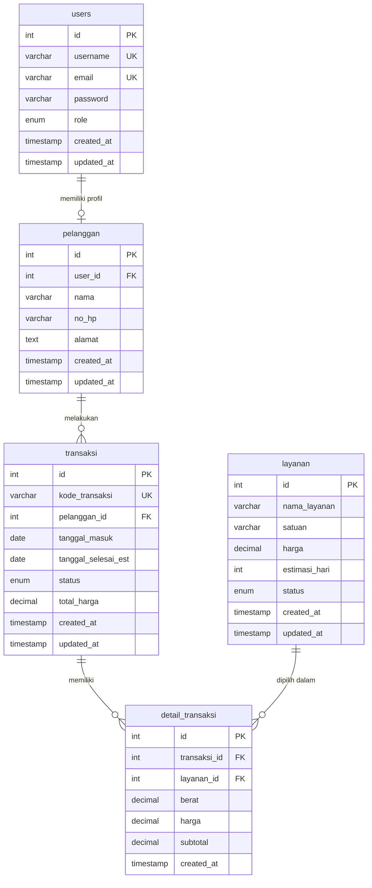

# ERD Sistem Informasi Laundry CleanWash

## Entitas dan Atribut

### 1. users
- id INT PK AI
- username VARCHAR(50) UNIQUE NOT NULL
- email VARCHAR(100) UNIQUE NOT NULL
- password VARCHAR(255) NOT NULL
- role ENUM('admin','pelanggan') NOT NULL
- created_at TIMESTAMP
- updated_at TIMESTAMP

### 2. pelanggan
- id INT PK AI
- user_id INT FK UNIQUE NOT NULL
- nama VARCHAR(100) NOT NULL
- no_hp VARCHAR(20) NOT NULL
- alamat TEXT NOT NULL
- created_at TIMESTAMP
- updated_at TIMESTAMP

### 3. layanan
- id INT PK AI
- nama_layanan VARCHAR(100) NOT NULL
- satuan VARCHAR(20) NOT NULL
- harga DECIMAL(12,2) NOT NULL
- estimasi_hari INT NOT NULL
- status ENUM('Aktif','Nonaktif') NOT NULL
- created_at TIMESTAMP
- updated_at TIMESTAMP

### 4. transaksi
- id INT PK AI
- kode_transaksi VARCHAR(30) UNIQUE NOT NULL
- pelanggan_id INT FK NOT NULL
- tanggal_masuk DATE NOT NULL
- tanggal_selesai_est DATE NOT NULL
- status ENUM('Menunggu','Dicuci','Dikeringkan','Disetrika','Selesai','Diambil') NOT NULL
- total_harga DECIMAL(12,2) NOT NULL
- created_at TIMESTAMP
- updated_at TIMESTAMP

### 5. detail_transaksi
- id INT PK AI
- transaksi_id INT FK NOT NULL
- layanan_id INT FK NOT NULL
- berat DECIMAL(8,2) NOT NULL
- harga DECIMAL(12,2) NOT NULL
- subtotal DECIMAL(12,2) NOT NULL
- created_at TIMESTAMP

## Relasi

## Relasi One-to-Many

1. Satu pelanggan dapat memiliki banyak transaksi.
2. Satu transaksi dapat memiliki banyak detail transaksi.
3. Satu layanan dapat digunakan pada banyak detail transaksi.

## Relasi One-to-One

1. Satu user dengan role pelanggan memiliki satu data profil pelanggan.

## Catatan Desain Database

- `detail_transaksi.harga` menyimpan harga saat transaksi dibuat agar histori harga tetap aman walaupun harga layanan berubah.
- `total_harga` pada transaksi dihitung dari subtotal detail transaksi.
- `ON DELETE RESTRICT` digunakan pada pelanggan dan layanan yang sudah digunakan transaksi agar histori transaksi tidak rusak.
